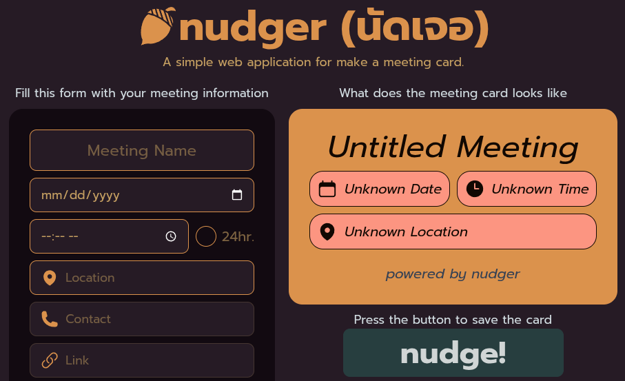
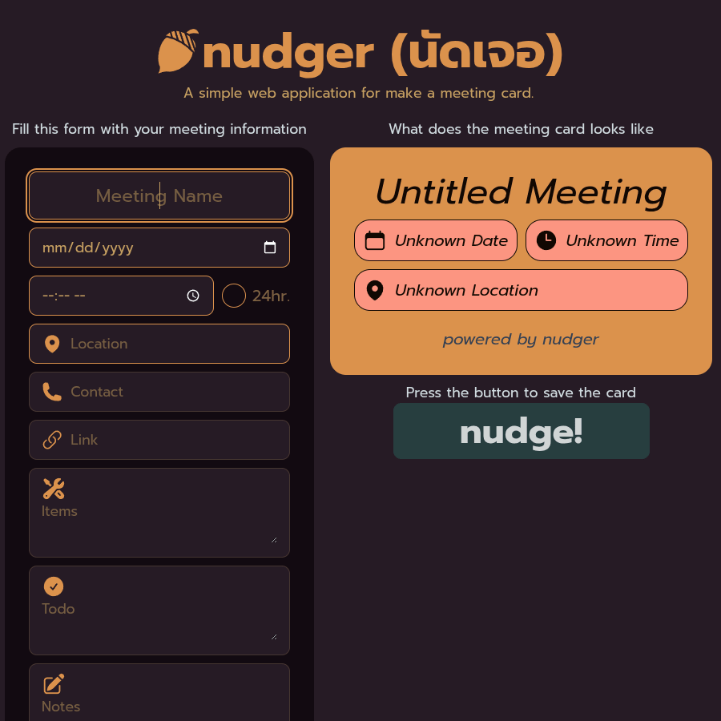
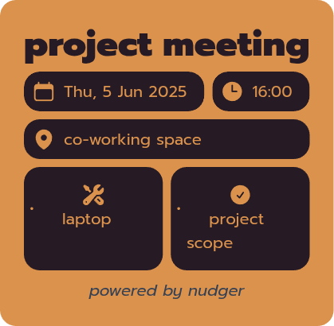

# 🗓️ nudger (นัดเจอ)

**A simple web application for making a meeting card.**

---

## 📌 Concept

Sometimes, when we make an appointment with friends or colleagues, the information tends to be scattered across chat messages — date, time, location, purpose, and participants might not all be in one place.  
**nudger** helps collect this information in one clear, card-style format that can be saved and shared easily, like a digital bulletin board.

Users can fill out key meeting details and export the card as an image to send to others instantly.

---

## 🚀 Features

- Fill in meeting information: title, date, time, location, contacts, links, items, todos, and notes
- Real-time preview of your meeting card
- Export the card as an image using `html2canvas`
- Location autocomplete using the [Nominatim API](https://nominatim.org/)
- Clean and responsive UI using **React.js**, **Tailwind CSS**, and **DaisyUI**

---

## 🛠 Tech Stack

- 🧠 **React.js** – Front-end framework
- 🎨 **Tailwind CSS** + **DaisyUI** – Styling & components
- 🌍 **Nominatim API** – Location search/autocomplete
- 🖼 **html2canvas** – Export meeting card to image

---

## 📎 Access the App

👉 [https://nudger.netlify.app/](https://nudger.netlify.app/)  

---

## 🙋‍♀️ About the Project

This is my **first personal front-end project using React.js**.  
I created it as a learning opportunity and a portfolio piece.  
There might be some imperfections, but I’ve learned a lot and had fun building it.  
Thanks for checking it out! ❤️

---

## 📷 Screenshots

